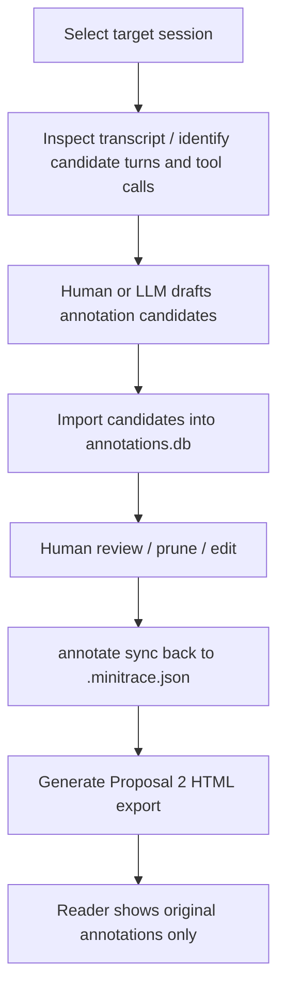

# Proposal 2 annotation workflow for read-only HTML reader exports

## Executive Summary

Proposal 2 currently has a working read-only export reader, but the annotation side is still largely manual and informal. The reader already knows how to render session-, turn-, and tool-call-level annotations. What it does **not** yet have is a disciplined workflow for deciding which annotations to create, how to batch them, how to use an LLM safely, and how to sync those annotations back into the archive before export.

This document proposes a future annotation workflow for Proposal 2 that is intentionally conservative. It keeps the current reader’s core rule intact:

> the export may display original annotations, but it must not invent synthetic annotation objects during export.

That means the workflow should produce **real** minitrace annotations using the existing schema and existing scopes (`session`, `turn`, `tool_call`). An LLM may help identify candidates and draft annotation text, but the final output must be concrete annotations added to the annotation store and then synced into the `.minitrace.json` archive.

The design is organized around a staged pipeline:

1. prepare a session for annotation,
2. identify candidate targets,
3. draft sparse high-value annotations,
4. import them into the annotation store,
5. review and prune them,
6. sync them back into the archive,
7. export the reader.

## Problem Statement

The current Proposal 2 design is deliberately literal. It avoids synthetic annotations, heuristic thread detection, and inferred semantic overlays. That makes the reader easier to trust, but it also creates a practical gap: if we want the reader to contain useful annotation context, we need a repeatable way to create those annotations.

Right now, the annotation tooling exists, but the workflow is underspecified for this particular use case.

What is missing:

- a clear annotation goal for the chronological reader,
- selection rules for what should and should not be annotated,
- a disciplined human/LLM collaboration model,
- a bulk workflow suitable for large sessions,
- a review and dedupe phase,
- and a clean integration point with export generation.

Without that workflow, one of two bad outcomes is likely:

1. **under-annotation**
   - the export technically supports annotations, but almost none are present, so the feature adds little value.

2. **over-annotation / low-value annotation**
   - the transcript gets flooded with routine notes that make the reader noisier rather than better.

The problem is therefore not “how do we support annotations in the schema?” The schema already exists. The problem is:

> How do we create a small, high-value, trustworthy annotation layer for Proposal 2 using the existing minitrace schema and tooling?

## Proposed Solution

The proposed solution is a **staged annotation pipeline** that uses the current minitrace annotation model as the canonical output and allows LLM assistance only as a drafting and triage tool.

### Core rules

The workflow keeps these invariants:

1. **Only original annotations are exported as annotations**
   - no exporter-generated synthetic annotation objects
2. **Only existing scopes are allowed**
   - `session`
   - `turn`
   - `tool_call`
3. **Only existing categories are used**
   - `observation`
   - `ai-failure`
   - `user-error`
   - `environment-issue`
   - `success`
   - `question`
   - `to-discuss`
   - `to-improve`
4. **Annotations must be sparse and high-value**
   - routine reads, routine edits, and repetitive tests should not be annotated
5. **The archive is the canonical export input**
   - annotations added via CLI/UI must be synced back into `.minitrace.json` before HTML export

### Workflow overview



### Phase 1: Preparation

Goal:
- decide which session is being annotated,
- ensure the operator knows the session ID,
- ensure the archive and output directory are correct.

Useful commands already exist:

```bash
go-minitrace query duckdb \
  --archive-glob './output/active/*/*.minitrace.json' \
  --preset session-list
```

For Proposal 2 work, the operator should also identify whether the annotation pass is intended to produce:

- a single high-value reviewed export,
- a larger batch of annotated sessions,
- or a pilot run just to test the workflow.

### Phase 2: Candidate discovery

This is where an LLM can help most safely.

The LLM should *not* immediately emit final annotations for every interesting-looking event. It should first identify likely candidates.

Candidate discovery should prioritize:

- session-level framing moments,
- turn-level requirement clarifications,
- turn-level architectural commitments,
- turn-level debugging pivots,
- tool-call-level decisive failures,
- tool-call-level first successful tests,
- tool-call-level environment problems,
- milestone documentation/report generation moments.

It should avoid:

- ordinary reads,
- ordinary edits,
- ordinary success states,
- repeated low-information retries,
- obvious transcript content that needs no extra explanation.

Desired output of this phase:

```json
[
  {
    "kind": "candidate",
    "scope_type": "turn",
    "target_id": "47",
    "reason": "Architecture decision that drives later work"
  },
  {
    "kind": "candidate",
    "scope_type": "tool_call",
    "target_id": "call_abc123",
    "reason": "First visible successful test after repeated failures"
  }
]
```

### Phase 3: Drafting real annotations

Once candidates are selected, a human or LLM can draft concrete annotation objects.

The draft format should stay close to what `annotate import` already accepts. That means a JSON array of objects containing:

- `session_id`
- `scope_type`
- `target_id`
- `annotator`
- `category`
- `title`
- `detail`
- `tags`
- optional taxonomy/classification fields

Example batch format:

```json
[
  {
    "session_id": "bbf1bdf1-364a-44cb-8cd0-ebcba86dd1ad",
    "annotator": "llm-draft",
    "scope_type": "turn",
    "target_id": "47",
    "category": "observation",
    "title": "Bridge approach becomes the working direction",
    "detail": "This turn marks a decisive shift toward the shared-memory/appsink-appsrc bridge path that later implementation work follows.",
    "tags": ["bridge", "architecture", "decision"]
  }
]
```

### Phase 4: Import into the SQLite working store

Instead of writing directly into the archive, the workflow should use the existing working-store model.

That keeps the first pass editable and reviewable.

Existing bulk-import path:

```bash
go-minitrace annotate import \
  --output-dir ./output \
  --file annotations.json
```

This is a strong fit for an LLM workflow because it decouples:

- annotation generation,
- annotation review,
- archive writeback.

### Phase 5: Review and prune

This phase is required. It is where Proposal 2 preserves quality.

Review questions:

- Is this annotation genuinely useful to a future engineer?
- Is this annotation grounded in explicit transcript evidence?
- Is this annotation redundant with another one nearby?
- Is the category correct?
- Is the title concise and specific?
- Does the detail explain why the target matters?

Useful commands:

```bash
go-minitrace annotate list --output-dir ./output --session <SESSION_ID>
go-minitrace annotate edit --output-dir ./output ...
go-minitrace annotate delete --output-dir ./output --id <ANNOTATION_ID>
```

The review pass should aim to produce a **smaller** set than the draft pass, not a larger one.

### Phase 6: Sync back to canonical archive

This is the crucial boundary.

The export pipeline reads `.minitrace.json` files. It does **not** read the SQLite working store directly. Therefore, annotations are not export-visible until they are synced.

Existing command:

```bash
go-minitrace annotate sync \
  --output-dir ./output \
  --session <SESSION_ID> \
  --dry-run

# then

go-minitrace annotate sync \
  --output-dir ./output \
  --session <SESSION_ID>
```

### Phase 7: Generate the HTML export

Only after sync should the normal Proposal 2 export run happen.

```bash
go-minitrace export html \
  --archive-glob './output/active/*/*.minitrace.json' \
  --session-id <SESSION_ID> \
  --output /tmp/session-reader.html
```

This preserves a clean model:

- annotation workflow produces original annotations,
- export renders original annotations,
- browser remains read-only.

## Annotation Rubric for Proposal 2

### What should be annotated

Good candidates include:

- major user constraints,
- architecture decisions,
- debugging pivots,
- decisive tool-call failures,
- decisive tool-call successes,
- important environment issues,
- milestone documentation/handoff events.

### What should not be annotated

Avoid annotating:

- every read,
- every edit,
- every bash command,
- every successful test rerun,
- routine continuation chatter,
- information already obvious from the immediate surrounding transcript.

### Target densities

Recommended densities for a large session:

- session annotations: `2–5`
- turn annotations: `10–25`
- tool-call annotations: `15–40`

The exact numbers are not sacred. The principle is.

### Example annotation types by scope

#### Session

- `observation`: “Main migration session”
- `to-discuss`: “Performance concerns remained open”
- `success`: “Historically valuable export candidate”

#### Turn

- `observation`: requirement clarification
- `question`: unresolved decision point
- `to-discuss`: strategic shift worth later review
- `to-improve`: clearly suboptimal reasoning or process

#### Tool call

- `success`: first passing test / milestone output
- `environment-issue`: missing plugin / dependency / runtime limitation
- `ai-failure`: failed fix attempt or ignored evidence
- `observation`: key source-file read or useful evidence run

## Human / LLM Collaboration Model

The LLM should be used as an **assistant reviewer**, not as an unquestioned annotation source.

### Recommended staged prompting

#### Stage A: candidate selection
Ask the model to identify high-value targets only.

#### Stage B: draft generation
Ask the model to convert those selected targets into annotation objects.

#### Stage C: dedupe/prune
Ask the model or a human reviewer to remove weak or redundant annotations.

This staged approach is better than one-shot annotation because it forces triage before text generation.

### LLM prompt skeleton

```text
You are annotating a minitrace session for a read-only chronological reader.
Use only the existing minitrace annotation schema.

Allowed scopes:
- session
- turn
- tool_call

Allowed categories:
- observation
- ai-failure
- user-error
- environment-issue
- success
- question
- to-discuss
- to-improve

Rules:
- Do not invent synthetic annotations.
- Do not create phase, thread, range, or timeline-only annotations.
- Prefer sparse, high-value annotations.
- Annotate only moments that help a future engineer understand the session faster.
- Ground every annotation in explicit transcript evidence.
- Do not annotate routine reads, routine edits, or obvious actions.
```

## Design Decisions

### Decision 1: Keep Proposal 2 annotation output strictly within the existing schema

Rationale:
- keeps the export reader simple,
- avoids schema drift,
- avoids coupling Proposal 2 to Proposal 4 timeline concepts.

### Decision 2: Use SQLite working store first, archive second

Rationale:
- matches current `annotate` workflow,
- preserves editability,
- allows review before mutating canonical archive files.

### Decision 3: Prefer bulk import for LLM batches

Rationale:
- `annotate import` is already a good integration point,
- avoids trying to script hundreds of `annotate add` calls,
- separates generation from application.

### Decision 4: Require explicit review/prune step

Rationale:
- keeps the exported reader readable,
- reduces false precision from LLM-generated notes,
- preserves trust in the annotations that remain.

### Decision 5: Do not make the exporter annotation-aware beyond normal payload loading

Rationale:
- the export command should not need special knowledge of “draft” vs “human” vs “LLM” provenance beyond what is already in the annotation fields,
- keeps export deterministic.

## Alternatives Considered

### Alternative A: exporter generates synthetic annotations automatically

Rejected for Proposal 2 because it violates the simplified design rule and blurs the line between data and inference.

### Alternative B: annotate directly in the browser export UI

Rejected for the current Proposal 2 export because the export must remain read-only and self-contained.

### Alternative C: skip the working store and write directly into `.minitrace.json`

Rejected because it removes the reviewable staging step and conflicts with the existing annotation model in `go-minitrace`.

### Alternative D: use a custom “annotation suggestion” schema completely separate from minitrace annotations

Partially rejected. A suggestion schema might be useful as an *intermediate* artifact for candidate discovery, but the final accepted output should still be converted into real minitrace annotations before export.

## Implementation Plan

### Phase 1: operational documentation

Deliverables:
- a concrete operator playbook for Proposal 2 annotation passes,
- example JSON templates for `annotate import`,
- one or more prompt packs for candidate selection and annotation drafting.

### Phase 2: supporting scripts

Deliverables:
- script to extract candidate turn/tool-call IDs for one session,
- script template for batch-importing drafted annotations,
- dry-run sync helper.

Possible ticket-local script layout:

```text
scripts/
  01-extract-annotation-candidates.sh
  02-generate-annotation-draft-template.py
  03-import-annotation-batch.sh
  04-review-and-sync-annotations.sh
```

### Phase 3: lightweight tooling improvements

Potential future enhancements:
- `annotate suggest` command that emits candidate targets without writing annotations,
- `annotate export-draft-template` helper for LLM batch preparation,
- better listing/filtering for tool-call-oriented review.

### Phase 4: validation loop

Deliverables:
- annotate one real large session,
- sync back to archive,
- export Proposal 2 HTML,
- evaluate reader usefulness and annotation density.

## Open Questions

1. Should we introduce an explicit `annotator` convention such as `human`, `llm-draft`, `llm-reviewed`, `user`, `researcher`?
2. Should LLM-generated batches include confidence or reasoning in an intermediate draft file, even if that data is not preserved in the final minitrace annotation schema?
3. Should we build a first-class `annotate suggest` command, or keep the first iteration as prompt-pack + external script tooling?
4. Should review happen entirely CLI-side, or should the live `serve` UI become the preferred annotation-review surface before sync?
5. How many annotations are too many for the Proposal 2 reader before it becomes noisier than the raw transcript?

## References

- `/home/manuel/code/wesen/corporate-headquarters/go-minitrace/pkg/doc/annotation-playbook.md`
- `/home/manuel/code/wesen/corporate-headquarters/go-minitrace/cmd/go-minitrace/cmds/annotate/add.go`
- `/home/manuel/code/wesen/corporate-headquarters/go-minitrace/cmd/go-minitrace/cmds/annotate/import.go`
- `/home/manuel/code/wesen/corporate-headquarters/go-minitrace/cmd/go-minitrace/cmds/annotate/synccmd.go`
- `/home/manuel/code/wesen/corporate-headquarters/go-minitrace/ttmp/2026/04/14/GST-2026-04-13--gstreamer-pi-sessions-analysis-with-go-minitrace/design-doc/04-proposal-2-chronological-reader-annotation-export-and-visualization-guide.md`
