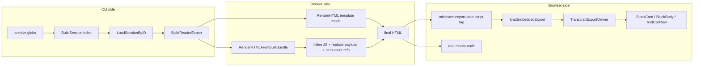

# Self-Contained HTML Transcript Exports - Under the Hood in go-minitrace

This document is a deep technical explanation of how the `go-minitrace` HTML export works under the hood. It is not primarily a changelog and not primarily a product spec. It is a systems-level description of the architecture, the data flow, the runtime contract, and the failure modes you will hit when you try to turn a large transcript archive into one shareable HTML file.

The core idea is easy to say and hard to get right:

> Take a session archive, reshape it into a reader-oriented JSON payload, inline everything needed to render that payload, and emit a single HTML file that still behaves like a decent application when opened locally.

That single sentence hides several different engineering problems:

- archive discovery,
- session normalization,
- payload design,
- safe HTML/script embedding,
- frontend bootstrapping,
- asset inlining,
- and browser validation.

## Why this note exists

There are many ways to render a transcript in a browser. Most of them are easier than producing a **self-contained** export.

If you are allowed to depend on a server, a database, or separately-hosted JS/CSS files, the problem is much more forgiving. If the page can call back into an API, you can defer work. If the page can fetch assets, you can keep the HTML small. If the page can assume a controlled dev server, you can ignore a lot of real-world packaging issues.

A self-contained export removes those escape hatches. That is why it is worth documenting carefully.

## When to use this pattern

Use this pattern when you need a transcript export that is:

- portable,
- shareable,
- archival,
- review-friendly,
- and read-only by design.

This is especially appropriate when:

- one session matters more than a whole archive browser,
- the recipient should not need to run `go-minitrace serve`,
- you want a single deliverable to attach to a ticket or handoff,
- or you care about long-term reproducibility.

Do **not** use this pattern when:

- the UI needs live mutations back into a store,
- the data is too large to reasonably embed as one HTML document,
- or the app depends on server-side search, pagination, or multi-user state.

## Core mental model

A good way to think about the export is this:

```text
archive files
  -> one selected session
  -> deterministic reader payload
  -> one HTML shell with embedded payload
  -> browser parses payload and mounts a read-only UI
```

The browser is not the source of truth. The archive is.

The browser is also not doing heavy semantic reconstruction. The backend export step is. The browser receives a pre-shaped payload and mostly performs presentation, local filtering, and local navigation.

That separation is important because it creates a stable contract:

- Go owns archive loading and normalization
- the export payload is the contract boundary
- React owns rendering of that payload

## Architecture



This architecture is deliberately conservative. It reuses the existing web UI where practical, but it avoids dragging the live web app assumptions into the export.

## End-to-end pipeline

### Step 1: archive glob expansion

The export command does not take one file directly. It takes one or more archive globs. That allows the export to work against the same archive layouts used elsewhere in `go-minitrace`.

The archive helper expands globs and reads the session ID from each file to build a session index.

That means the export path behaves like this:

```text
"/path/to/output/active/*/*.minitrace.json"
  -> expand matching files
  -> read minimal metadata from each file
  -> map session id -> archive path
```

Why use an index instead of loading all sessions fully?

- duplicate session IDs can be caught early
- you keep selection explicit
- you only fully unmarshal the chosen session

### Step 2: session loading

Once a session ID is selected, the exporter loads exactly that session and unmarshals it into `minitrace.Session`.

This is a useful seam because it preserves compatibility with the existing `.minitrace.json` contract. The export layer does not invent a new on-disk format.

### Step 3: deterministic reader shaping

The `ReaderExport` payload is the real heart of the implementation.

The exporter does *not* hand the raw session object straight to the frontend. Instead, it normalizes the session into a reader-oriented structure:

- session metadata
- prompt-centered blocks
- normalized turns
- normalized tool calls
- annotations
- deterministic indices

This shaping is where the UI gets simpler.

If the frontend had to repeatedly infer block boundaries, map tool call IDs to full tool-call objects, and build annotation lookup maps on every load, the browser code would become much more fragile.

### Step 4: HTML construction

There are two HTML-construction paths.

#### Path A: template renderer

This is the simpler path. Go embeds a template, CSS, and JS from `pkg/exporthtml/templates/*` and renders them directly with the payload.

The advantage is simplicity.

The disadvantage is that it does not reuse as much of the real web UI.

#### Path B: built-bundle renderer

This is the more interesting path. A dedicated export-reader bundle is produced with Vite. Go then:

1. reads the built `export-reader.html`
2. finds its module script
3. reads the referenced JS bundle
4. replaces the module script tag with inline JS
5. replaces the placeholder payload script with the real payload
6. strips any remaining external `<script src>` or `<link href>` tags
7. writes the final HTML

This is the critical packaging move. The frontend is still written like a normal web app entrypoint, but the final delivered artifact is one HTML file.

## Payload shape and why it matters

A self-contained export succeeds or fails on the quality of its embedded payload.

The current payload is intentionally plain JSON. It is versioned, generic, and renderer-agnostic enough that a future non-React reader could still consume it.

### What the payload contains

At a high level:

```json
{
  "version": "reader-export-v1",
  "session": { ... },
  "annotations": [ ... ],
  "indices": {
    "session_annotation_ids": [ ... ],
    "turn_to_annotations": { ... },
    "tool_call_to_annotations": { ... },
    "search": { "terms": { ... } }
  }
}
```

### Why blocks exist

The block concept is a presentation-oriented normalization.

Without blocks, the transcript is just one flat turn sequence. That is accurate but tiring to read. A block says: “this user turn and the assistant/tool activity that follows belong together.”

This is deterministic because the rule is simple:

- a user turn starts a new block
- following non-user turns belong to that block until the next user turn

That gives the reader structure without heuristic thread detection.

### Why indices exist

The reader currently only uses some of the available indices directly, but embedding them is still valuable.

They serve three purposes:

1. they make the payload more self-describing
2. they reduce repeated frontend recomputation
3. they create a future-friendly contract for richer local filtering/search/navigation

## The script-tag problem

This is one of the easiest problems to underestimate.

A lot of transcript content looks harmless until you remember how it is embedded. The export places JSON inside:

```html
<script id="minitrace-export-data" type="application/json">...</script>
```

That means transcript content is no longer “just JSON data”. It is JSON **inside HTML inside a script tag**.

That creates a dangerous class of bugs.

### Failure mode: accidental script termination

If the payload contains a raw `</script>` sequence, the browser can interpret it as the end of the script block even though it came from transcript content.

That produces a spectacularly confusing symptom:

- the HTML file loads,
- the page title may even look right,
- but the app body is broken because the payload was terminated early.

### Fix: dedicated script-tag-safe payload marshaling

The implementation now marshals the payload once and then escapes characters that are dangerous in this embedding context:

- `<` -> `\u003c`
- `>` -> `\u003e`
- `&` -> `\u0026`
- U+2028 and U+2029 -> escaped Unicode sequences

This is the correct mental model:

> JSON validity is not enough. The payload must be valid *for its embedding context*.

## The replacement-semantics problem

A second under-the-hood problem showed up only with a large real transcript.

The built-bundle renderer originally used regex replacement APIs in places where the replacement string was the full payload or the full JS bundle.

That is dangerous because regex replacement strings have special semantics for `$0`, `$1`, and so on.

But transcript data and shell snippets frequently contain strings like:

- `$0`
- `$1`
- `$(dirname "$0")`

If those go through regex replacement semantics, the output can be corrupted even though the input JSON was fine.

### Fix: literal-safe replacement

The renderer now uses literal-safe replacement functions for:

- the inlined module bundle
- the payload script replacement
- the title replacement

That preserves the payload exactly as data.

This is another important rule:

> Do not use a regex replacement API when the replacement text is itself large, user-derived, or transcript-derived content.

## Frontend boot sequence

The frontend entrypoint is intentionally tiny.

### Boot pseudocode

```text
const data = loadEmbeddedExport()
createRoot(document.getElementById("root")).render(
  <ThemeProvider theme={theme}>
    <CssBaseline />
    <TranscriptExportViewer data={data} />
  </ThemeProvider>
)
```

This does three good things:

- it keeps the boot contract explicit
- it removes any dependency on router/API state
- it keeps export-specific logic near the entrypoint, not smeared across the whole app

### Why reuse the existing viewer components

The project deliberately reuses:

- `BlockCard`
- `BlockBody`
- `ToolCallRow`

This is a pragmatic decision.

Those components already know how to present turns, tool calls, artifacts, and annotation chips. Reusing them reduces design drift between the live app and the export, and it lets the export feature advance faster.

The trick is not “reuse everything”. The trick is “reuse the right layer”.

What was *not* reused:

- live RTK Query data plumbing
- router pages
- mutation flows for annotations
- broader app-shell assumptions

That separation is why the export remains portable.

## Read-only interaction model

A read-only export is still interactive. It just mutates **view state**, not **document state**.

The browser is allowed to:

- expand/collapse blocks
- expand/collapse tool-call details
- filter visible blocks by search query
- react to hash changes
- scroll to a target and highlight it

The browser is *not* allowed to:

- create or persist new annotations
- call back into a server
- edit transcript content
- fetch replacement data

That distinction keeps the product honest.

## Hash navigation

One of the nicer reader affordances is stable hash navigation:

- `#turn-<idx>`
- `#tool-call-<id>`

That required a few coordinated behaviors:

1. parse the hash into a `FocusedTranscriptTarget`
2. determine which block contains the target
3. force-expand that block
4. ensure a targeted tool call is expanded
5. scroll the element into view
6. visually highlight the target

This is a good example of export-friendly interactivity. It adds real value while keeping the document self-contained.

## Real-world browser validation

The feature became much more credible once it was validated against a large real session rather than just unit tests.

Key checks included:

- the generated HTML can be loaded as a browser document
- there are no external JS/CSS/data fetches from the export
- search filters visible blocks correctly
- hash navigation expands and focuses the correct target
- large payloads do not break the page

One practical wrinkle: the Playwright harness blocked `file://` navigation. That meant browser validation had to be performed via a temporary local HTTP server. This is a useful reminder that “self-contained export” validation sometimes needs both structural checks and environment-aware browser checks.

## Common failure modes

### 1. Nil vs empty arrays

A subtle bug surfaced when a session had no annotations. The backend exported:

```json
"annotations": null
```

but the frontend iterated it like an array.

That caused a runtime crash.

Fixes:

- backend now guarantees `annotations` marshals as `[]`
- frontend defensively normalizes non-array annotations to `[]`

### 2. leftover asset tags in the built shell

Even after inlining the main JS bundle, the built HTML shell could grow additional asset references later — icons, preload hints, or extra scripts.

If those stay in the final output, the export is no longer truly self-contained.

Fix:

- strip remaining `<script src>` and `<link href>` tags after inlining

### 3. treating the browser as the normalization layer

If too much shaping is pushed into the browser, the export gets harder to validate and harder to keep stable.

The export should not boot into a “mini backend written in React”.

### 4. assuming small payloads

Transcript exports can be huge. Testing only tiny payloads gives false confidence.

Large payloads expose:

- embedding bugs
- replacement bugs
- memory assumptions
- UI truncation problems

## Anti-patterns

Avoid these patterns when building this kind of export:

- **embedding raw unescaped JSON into a script tag**
- **using regex replacement APIs with large data-derived replacement strings**
- **letting the export UI depend on live API abstractions**
- **adding heuristic “smartness” before the literal export is stable**
- **treating self-contained export as only a frontend problem**

The backend packaging path is at least half the work.

## Recommended implementation sequence

If you were rebuilding this from scratch, the safest sequence would be:

1. add a backend payload type and builder
2. add a minimal template-based HTML renderer
3. validate that the single-file contract works at all
4. add a dedicated export frontend entrypoint
5. inline the built bundle from Go
6. add search and hash navigation
7. harden the embedding path for large payloads
8. validate against a real large session

That sequence works because each step preserves a testable artifact.

## Worked pseudocode

### Export side

```text
func exportHTML(archiveGlobs, sessionID, outputPath, webDistDir):
    index = BuildSessionIndex(archiveGlobs)
    session = LoadSessionByID(index, sessionID)
    payload = BuildReaderExport(session)

    if webDistDir != "":
        html = RenderHTMLFromBuiltBundle(payload, webDistDir)
    else:
        html = RenderHTML(payload)

    write outputPath = html
```

### Built-bundle render side

```text
htmlShell = read export-reader.html
jsPath = extract module script src from htmlShell
jsBundle = read jsPath
payloadJSON = marshalPayloadForScriptTag(payload)

htmlShell = inline module bundle literally
htmlShell = strip remaining script src tags
htmlShell = strip remaining link href tags
htmlShell = replace payload script literally
htmlShell = replace title literally
return htmlShell
```

### Browser side

```text
payload = JSON.parse(document.getElementById("minitrace-export-data").textContent)
annotations = Array.isArray(payload.annotations) ? payload.annotations : []
focusedTarget = parseHash(location.hash)
visibleBlocks = applySearch(payload.session.blocks, query)
render TranscriptExportViewer(payload, annotations, visibleBlocks, focusedTarget)
```

## Working rules

If you maintain this export path, these are good rules to keep in your head:

1. **The payload is the product boundary.** Treat it like an API contract.
2. **HTML embedding context matters.** Safe JSON is not automatically safe script-tag JSON.
3. **Literal replacement beats clever replacement.** Large transcript-derived strings should be inserted literally.
4. **Reuse the view layer, not the whole app.** Pull in components, not server assumptions.
5. **Validate against a big real session early.** Tiny synthetic sessions hide the worst bugs.

## Related notes

- `reference/03-project-report-go-minitrace-html-export-reader.md`
- `design-doc/04-proposal-2-chronological-reader-annotation-export-and-visualization-guide.md`
- `reference/01-investigation-diary.md`
- `reference/02-export-reader-dev-workflow.md`
