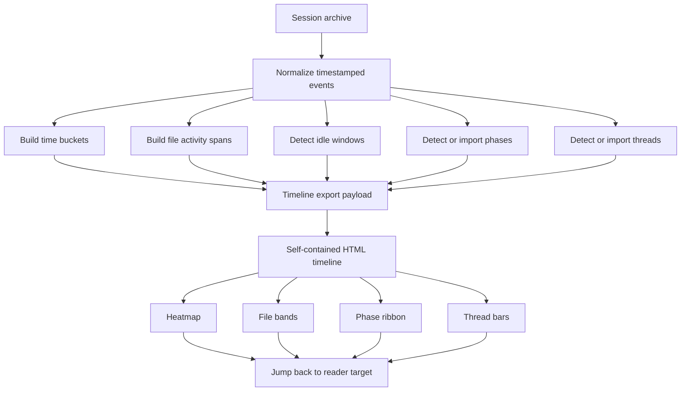

# Proposal 4 timeline visualization implementation and analysis guide

## Executive Summary

Proposal 4 is the timeline-oriented companion to the chronological reader export. Where Proposal 2 answers “what happened, in order?”, Proposal 4 answers “when did different kinds of work happen, how intense were they, when did the work pivot, and where should I jump into the transcript if I want a specific phase?”

The implementation goal is a **read-only, self-contained HTML timeline export** that works from the same archive source material as the reader export but emits a different view-model optimized for macro-structure rather than narrative detail.

The timeline export should:

- derive time buckets from session/turn/tool-call timestamps,
- show activity intensity over time,
- show which files were active during which periods,
- represent idle windows explicitly,
- surface phase markers and thread spans,
- and provide deterministic jump targets back into the reader view.

A major implementation constraint for this ticket is that as much of the analysis as possible should be expressed as SQL queries so it can also be packaged as reusable query commands instead of living only inside exporter-specific Go code.

This ticket treats Proposal 4 as a **separate product line** from Proposal 2. That separation matters. Proposal 2 stayed intentionally literal and does not synthesize annotations. Proposal 4 is where derived temporal structures *do* belong, because they are the essence of the view.

## Problem Statement

Long sessions are hard to understand at macro scale from the chronological reader alone.

A reader can reveal:

- what the user asked,
- what the assistant did,
- which commands ran,
- what output came back,
- and which explicit annotations were attached.

But a reader is still fundamentally local. It is strong at turn-to-turn causality and weak at temporal compression.

For a long session, a reviewer often wants a different kind of answer:

- when did the session start doing “real implementation work”?
- when did a debugging loop begin?
- when did one file become dominant?
- were two threads parallel or sequential?
- where were long idle gaps?
- where should a reviewer enter the transcript if they only care about the validation phase?

Those are not really “reader” questions. They are timeline questions.

Without a dedicated timeline abstraction, reviewers must infer all of this manually from hundreds of turns. That is slow, inconsistent, and hard to preserve in a portable export.

So the problem is:

> How do we derive truthful, testable temporal structure from a session archive and render it as a self-contained HTML visualization that remains read-only and links back into the transcript details?

## Proposed Solution

The proposed solution is a dedicated Proposal 4 export path with four layers:

1. **raw timestamped event extraction**
   - turns
   - tool calls
   - file touches
   - original annotations
2. **SQL-first derived temporal analysis**
   - bucketization
   - file activity series
   - idle windows
   - phase candidate signals
   - thread candidate signals where feasible
3. **timeline export payload**
   - chart-ready arrays
   - labels
   - deterministic jump targets
4. **read-only browser timeline UI**
   - heatmap
   - file bands
   - phase ribbons
   - thread bars
   - click-to-reader jump behavior

The export path should reuse or embed analysis that can also stand alone as query commands. Where a structure can be computed with SQL over the archive, we should prefer doing that in SQL rather than burying the logic in Go-only exporters.

### System overview



### Key runtime principle

The browser should not compute the timeline from scratch.

The browser may:

- render,
- filter,
- hover,
- expand legends,
- and jump.

But the browser should *not* own the heavy temporal math. Bucketization, phase detection, idle analysis, and thread span generation belong to export time, where they can be tested deterministically.

### SQL-first analysis principle

The preferred layering for Proposal 4 is:

1. compute as much temporal analysis as possible with SQL,
2. package broadly useful analyses as query commands,
3. use Go mainly to orchestrate query execution, merge result sets, normalize them into the timeline payload, and render the HTML export.

This makes the work more reusable, more inspectable, and easier to validate independently of the timeline UI.

## Analysis Model

Proposal 4 needs a stronger derived-data layer than Proposal 2.

### Raw inputs

The likely core inputs are:

- `timing.started_at`
- `timing.ended_at`
- `turns[].timestamp`
- `tool_calls[].timestamp`
- `turns[].tool_calls_in_turn`
- tool-call operation type
- tool-call file path / command metadata
- original annotations already present in the archive

### Derived structures

The first implementation should produce at least these derived structures.

For each one, the default question should be: can this be fully expressed as a SQL query command, or at least as a SQL intermediate table that Go can finish shaping?

#### 1. Time buckets

A bucket is a fixed time window, e.g. 15 or 30 minutes.

This should be SQL-first. A query command should unnest timestamped events, assign them to buckets, and return one row per bucket.

Each bucket should capture:

- start time
- end time
- total tool calls
- total turns
- operation breakdown
- unique files touched
- whether any error-like activity occurred
- a canonical reader jump target for the bucket

#### 2. File activity series

This should also be SQL-first. A query command should return per-file per-bucket activity rows that Go can reshape into series arrays.

For each significant file, build a sparse or dense per-bucket activity series that answers:

- was the file touched in this bucket?
- how many reads/modifies/new ops happened?
- which operation dominated?

This powers file bands and hot-file comparisons.

#### 3. Idle windows

Idle detection should start from SQL-derived bucket activity counts. A query command can emit bucket activity rows or direct idle-window candidates that Go can normalize.

Detect windows with low or no activity according to configurable thresholds.

These are important because long sessions often contain:

- breaks,
- waiting periods,
- external testing gaps,
- or resumed work after a pause.

#### 4. Phase markers

These are the most interpretation-heavy derived structures.

The first implementation should still try to stay SQL-first by computing phase-signal tables in SQL, such as buckets dominated by edits, buckets dominated by errors, or validation-heavy buckets. Go can then merge those signals or import manual phase spans.

Examples:

- discovery
- implementation burst
- debugging loop
- validation
- wrap-up

A first implementation should permit **manual or imported phase markers first**, then later optionally add heuristics.

#### 5. Thread spans

Threads are topic/file/problem spans over time.

This is the least SQL-friendly structure if we want semantic reconstruction, but it should still begin with SQL-friendly primitives such as file-touch spans, command-pattern spans, and repeated target-file clusters.

A future timeline should show:

- a bridge thread,
- a preview thread,
- a performance thread,
- a documentation/reporting thread,

as time spans that may be contiguous or segmented.

Again, for first implementation, manual/imported spans are safer than complex automatic detection.

## Scope of “annotations” in Proposal 4

Proposal 4 differs from Proposal 2 here.

Proposal 2 says:
- only original annotations are annotations.

Proposal 4 says:
- the timeline may include **derived temporal markers** such as phases and thread spans, because those are core timeline structures rather than reader-side commentary.

To reduce confusion, the implementation should likely distinguish between:

- **original annotations** from minitrace,
- **derived timeline markers** in the timeline payload.

I would avoid calling every derived structure an “annotation” in code. Use distinct types where possible:

- `OriginalAnnotation`
- `PhaseMarker`
- `IdleWindow`
- `ThreadSpan`

That keeps the model clean and avoids leaking Proposal 4 semantics back into Proposal 2.

## Data model proposal

A first payload could look roughly like this:

```json
{
  "version": "timeline-export-v1",
  "session": {
    "id": "...",
    "title": "...",
    "started_at": "...",
    "ended_at": "..."
  },
  "timeline": {
    "bucket_minutes": 30,
    "buckets": [],
    "file_series": [],
    "idle_windows": [],
    "phase_markers": [],
    "thread_spans": []
  },
  "reader_links": {
    "bucket_to_turn": {},
    "phase_to_turn": {},
    "thread_to_turn": {}
  },
  "annotations": []
}
```

### Bucket shape

```json
{
  "bucket_id": "b-12",
  "start_ts": "2026-04-13T18:00:00Z",
  "end_ts": "2026-04-13T18:30:00Z",
  "turn_count": 14,
  "tool_call_count": 29,
  "error_count": 3,
  "active_file_count": 5,
  "operation_counts": {
    "READ": 12,
    "MODIFY": 7,
    "NEW": 1,
    "EXECUTE": 9
  },
  "jump_turn_idx": 147
}
```

### File series shape

```json
{
  "file_path": "pkg/media/gst/recording.go",
  "series": [0, 0, 2, 5, 7, 1, 0],
  "dominant_operation_by_bucket": ["", "", "READ", "MODIFY", "MODIFY", "READ", ""]
}
```

### Phase marker shape

```json
{
  "phase_id": "phase-debugging-loop",
  "label": "Debugging loop",
  "start_bucket": 8,
  "end_bucket": 13,
  "jump_turn_idx": 412,
  "source": "manual"
}
```

### Thread span shape

```json
{
  "thread_id": "thread-preview-path",
  "label": "Preview path",
  "segments": [
    { "start_bucket": 5, "end_bucket": 7 },
    { "start_bucket": 10, "end_bucket": 12 }
  ],
  "jump_turn_idx": 266,
  "source": "manual"
}
```

### Current manual/imported marker convention

The current Go-side implementation now supports manual/imported phase and thread markers through ordinary synced `minitrace.Annotation` objects without extending the archive schema.

Current convention:

- use **session-scoped** annotations,
- keep a standard valid annotation category such as `observation`,
- add tag `timeline-phase` for phase markers,
- add tag `timeline-thread` for thread spans,
- place the marker payload in `annotation.content.detail` as JSON.

Current detail JSON shapes:

Phase marker annotation detail:

```json
{
  "phase_id": "phase-debugging-loop",
  "label": "Debugging loop",
  "start_bucket": 8,
  "end_bucket": 13,
  "jump_turn_idx": 412,
  "source": "manual"
}
```

Thread span annotation detail:

```json
{
  "thread_id": "thread-preview-path",
  "label": "Preview path",
  "file_path": "pkg/media/gst/preview.go",
  "segments": [
    { "start_bucket": 5, "end_bucket": 7 },
    { "start_bucket": 10, "end_bucket": 12 }
  ],
  "jump_turn_idx": 266,
  "source": "manual"
}
```

This gives Proposal 4 a practical manual/import path immediately while preserving the existing minitrace annotation schema and SQLite/import/sync workflows.

### Final v1 payload decisions

For the first implementation, this ticket now fixes the following defaults:

- **bucket size default:** `30` minutes
- **original annotations vs derived markers:** keep them separate in the payload model
  - original minitrace annotations remain under `annotations`
  - derived structures live under `timeline.*`
- **jump target contract:** all clickable timeline elements resolve to a reader turn index
  - buckets use the earliest turn seen in the bucket
  - phases use the chosen representative/starting turn
  - threads use the earliest meaningful turn in the span
- **reader deep-link format:** Proposal 4 should target Proposal 2-compatible hashes of the form `#turn-<idx>`

These defaults can evolve later, but they are stable enough to let the SQL commands and Go payload merger converge on one contract.

## Design Decisions

### Decision 1: Proposal 4 should be a distinct export mode, not a variant flag bolted onto Proposal 2

Rationale:
- the data model is different,
- the UI is different,
- the analysis responsibilities are different,
- and Proposal 4 needs derived temporal structures Proposal 2 intentionally excludes.

### Decision 2: Export-time bucketization, not browser-time bucketization

Rationale:
- easier to test,
- deterministic payloads,
- simpler browser runtime,
- better large-session behavior,
- and easier to package as reusable SQL query commands.

### Decision 3: SQL query commands should own as much of the analysis as possible

Rationale:
- aligns with existing go-minitrace query workflows,
- makes the analysis reusable outside the export path,
- lets us validate exports against stable intermediate result sets,
- and reduces hidden logic in exporter-only Go code.

Likely query commands:
- `timeline-buckets`
- `timeline-file-activity`
- `timeline-idle-windows`
- `timeline-phase-signals`
- `timeline-thread-signals`

### Decision 4: Manual/imported phases and threads before automatic heuristics

Rationale:
- easier to trust,
- easier to explain,
- easier to validate with real sessions.

Automatic detection can come later once the payload and UI exist.

### Decision 5: Timeline clicks should always resolve to transcript jumps

Rationale:
- the timeline is useful only if it helps the user re-enter the transcript at the right place.
- all major timeline structures need jump targets.

### Decision 6: Prefer SVG for core timeline visuals

Rationale:
- self-contained and portable,
- precise for heatmaps and bands,
- printable,
- no canvas rasterization complexity for v1.

## Suggested file layout

A plausible implementation layout is:

```text
query-commands/timeline/
  timeline-buckets.sql
  timeline-file-activity.sql
  timeline-idle-windows.sql
  timeline-phase-signals.sql
  timeline-thread-signals.sql

pkg/analysis/timeline/
  merge.go
  phases.go
  threads.go
  types.go

pkg/exporttimeline/
  archive.go
  builder.go
  types.go
  render.go
  render_test.go
  builder_test.go

pkg/exporttimeline/templates/
  timeline.html.tmpl
  timeline.css
  timeline.js
```

If we later decide to share code with `pkg/exporthtml`, the common pieces could be factored after the first implementation proves itself.

## Query command result contracts

The first SQL-first slice should stabilize these result contracts.

### `timeline-buckets`

One row per bucket with at least:

- `session_id`
- `bucket_idx`
- `bucket_start`
- `bucket_end`
- `turn_count`
- `tool_call_count`
- `read_count`
- `modify_count`
- `new_count`
- `execute_count`
- `error_count`
- `active_file_count`
- `jump_turn_idx`

### `timeline-file-activity`

One row per file per bucket with at least:

- `session_id`
- `file_path`
- `file_rank`
- `total_operations`
- `bucket_idx`
- `operations`
- `read_count`
- `modify_count`
- `new_count`
- `execute_count`
- `dominant_operation`

### `timeline-idle-windows`

One row per contiguous idle candidate window with at least:

- `session_id`
- `start_bucket_idx`
- `end_bucket_idx`
- `idle_start`
- `idle_end`
- `bucket_count`
- `tool_call_count_in_window`

### `timeline-phase-signals`

One row per bucket with at least:

- `session_id`
- `bucket_idx`
- `tool_call_count`
- `read_count`
- `modify_count`
- `new_count`
- `execute_count`
- `error_count`
- `validation_signal_count`
- `code_read_signal_count`
- `implementation_signal_count`
- `dominant_phase_signal`

### `timeline-thread-signals`

One row per contiguous file-based candidate span with at least:

- `session_id`
- `file_path`
- `start_bucket_idx`
- `end_bucket_idx`
- `bucket_span`
- `total_operations`
- `jump_turn_idx`

These contracts should be treated as the stable handoff boundary between SQL analysis and the Go timeline payload merger.

## Implementation Plan

### Phase 1: SQL query-command foundation

Deliverables:
- basic timeline payload structs,
- `timeline-buckets` query command,
- `timeline-file-activity` query command,
- jump target mapping,
- tests/golden outputs over bucket boundaries and counts.

Validation:
- bucket counts match raw event counts,
- boundary conditions around first/last events behave correctly,
- file-path aggregation matches existing query evidence.

### Phase 2: SQL-first idle and signal analysis

Deliverables:
- `timeline-idle-windows` query command,
- `timeline-phase-signals` query command,
- optional `timeline-thread-signals` query command,
- Go-side merger for combining query outputs into one payload.

Validation:
- compare against known long gaps from session timestamps and diary evidence,
- verify signal tables match intuitive session periods.

### Phase 3: manual/imported phases and threads

Deliverables:
- import/manual phase marker support,
- import/manual thread span support,
- payload representation for both,
- ability to merge imported spans with SQL-derived signal tables.

Validation:
- clicking a phase jumps to a sensible transcript entry,
- thread spans can represent interrupted work,
- jump target logic still works for segmented threads.

### Phase 4: browser rendering

Deliverables:
- self-contained timeline page,
- heatmap,
- file bands,
- legends,
- hover labels,
- click-to-reader hash navigation.

Validation:
- no network requests,
- no console errors,
- offline behavior,
- acceptable load/render time for large sessions.

## Validation and test strategy

The first implementation should treat data correctness as more important than visual polish.

### Backend tests

Need tests for:

- query-command outputs for known fixtures,
- bucket boundary math,
- file series aggregation,
- idle window detection,
- phase/thread import handling,
- payload rendering.

### Fixture validation

Use at least one large real session, likely:

- `bbf1bdf1-364a-44cb-8cd0-ebcba86dd1ad`

And at least one smaller session to catch edge cases where:

- there are very few buckets,
- there are no large gaps,
- file activity is sparse.

### Browser validation

Validate:
- page loads without a server if possible,
- no external JS/CSS/data requests,
- clicking a bucket/phase/thread jumps into the reader correctly,
- the legend and labels remain readable,
- the timeline remains understandable on a long session.

## Alternatives Considered

### Alternative A: Only add a sparkline into the existing reader

Rejected because it gives some temporal flavor but does not create a true macro-structure tool.

### Alternative B: Compute everything in Go with no reusable SQL layer

Rejected because it would hide reusable analysis inside exporter-only code and make it harder to package the same logic as query commands.

### Alternative C: Compute everything in the browser from raw reader payload

Rejected for v1 because it would overcomplicate the browser and weaken determinism/testability.

### Alternative D: Skip phases and threads entirely and show only raw bucket counts

Partially rejected. This could be an internal milestone, but not the final Proposal 4 value proposition. Proposal 4 exists precisely to reveal larger temporal structures.

### Alternative E: Merge Proposal 4 into Proposal 2 as a toggle in the same page

Rejected initially because it would mix two different mental models too early. Better to get a strong standalone timeline payload/view first, then decide how integration should feel.

## Open Questions

1. Should phases and threads live in a dedicated import format, or should we try to encode them through the existing annotation schema plus derived translation rules?
2. What should the initial bucket size be: 15 minutes, 30 minutes, or adaptive?
3. Should file bands show only top-N files or a scrollable larger set?
4. What is the right minimum threshold for showing a thread as a first-class span instead of clutter?
5. Should the first implementation render as pure SVG, or SVG plus lightweight HTML overlays for tooltips/labels?

## Final Recommendation

Build Proposal 4 in this order:

1. SQL bucket/file activity queries,
2. SQL idle/phase-signal queries,
3. Go payload merger,
4. heatmap,
5. file bands,
6. idle windows,
7. phase ribbon,
8. thread spans,
9. click-to-reader behavior.

That order ensures the first milestone is already useful and testable. The project should not begin with visual sophistication. It should begin with truthful temporal data.

## References

- `/home/manuel/code/wesen/corporate-headquarters/go-minitrace/pkg/minitrace/schema.go`
- `/home/manuel/code/wesen/corporate-headquarters/go-minitrace/pkg/query/engine.go`
- `/home/manuel/code/wesen/corporate-headquarters/go-minitrace/pkg/query/presets/timing-analysis.sql`
- `/home/manuel/code/wesen/corporate-headquarters/go-minitrace/ttmp/2026/04/14/GST-2026-04-13--gstreamer-pi-sessions-analysis-with-go-minitrace/design-doc/05-proposal-4-timeline-visualization-annotation-export-and-visualization-guide.md`
- `/home/manuel/code/wesen/corporate-headquarters/go-minitrace/ttmp/2026/04/14/GST-2026-04-13--gstreamer-pi-sessions-analysis-with-go-minitrace/query-commands/session-timeline.sql`
